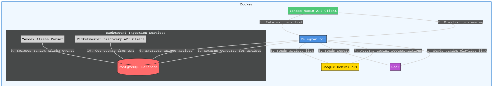

# Бот рекомендаций концертов

Асинхронный Telegram-бот, который принимает ссылку на плейлист Яндекс Музыки, выкачивает всех артистов, ищет их концерты по нескольким провайдерам и возвращает пользователю удобное расписание мероприятий с фильтрами и подсказками.

## Схема системы



## Что будет видеть пользователь

1. Клиент отправляет ссылку на публичный плейлист из Яндекс Музыки:
    - Вот ссылка на мой плейлист: "https://music.yandex.ru/playlists/ar.ed..."

2. Бот отвечает и начинает анализ плейлиста:
    - Сканирую плейлист (это займет ~2-3 минуты)
    - Высвечивается индикатор загрузки: "Обработано 200/2500 треков..."

3. О готовности сообщает бот:
    - Готово, вот список концертов по Вашим интересам:
        ➤ список концертов его любимых артистов
        ➤ даты, города, площадки
        ➤ кнопки: "Показать только Москву", "Сортировать по артисту", "Добавить напоминание"

Пользователь получает удобный календарь с ближайшими концертами с понятным интерфейсом.

## Архитектура и сервисная логика системы

Проект построен по сервисно-ориентированной архитектуре, где каждая крупная задача вынесена в отдельный модуль. Это упрощает масштабирование, поддержку и командную разработку.

Можем разделить систему на 5 уровней:

1. **Client interface** — Telegram-бот и взаимодействие с юзером
2. **Service layer** — бизнес-логика: парсинг плейлистов, поиск концертов, рекомендации
3. **Data aggregation layer** — сбор и нормализация данных о концертах из источников
4. **Data Layer** — базы данных (PostgreSQL для событий, MongoDB для артистов)
5. **External APIs** — внешние источники данных (Yandex Music API, Ticketmaster API, Yandex Afisha)  

---

## Структура проекта

```
src/
├── bot/                    # Telegram-бот
│   ├── handlers/           # Обработчики сообщений
│   └── main.py             # Точка входа бота
├── clients/                # Клиенты для внешних API
│   ├── global_concert_client.py  # Ticketmaster API клиент
│   └── local_concert_client.py  # Yandex Afisha парсер (через Selenium)
├── config/                 # Конфигурация
│   └── settings.py         # Настройки приложения
├── db/                     # Модели и подключение к БД
│   ├── models.py           # SQLAlchemy модели (Event)
│   └── database.py         # Настройка подключения к PostgreSQL
├── repositories/           # Репозитории для работы с БД
│   └── concert_repository.py
├── services/               # Бизнес-логика проекта
│   ├── concert_service.py  # Поиск концертов по артистам
│   ├── music_playlist_client.py  # Клиент Yandex Music API
│   ├── playlist_service.py # Сервис работы с плейлистами
│   └── recommendation_service.py  # AI-рекомендации (Google Gemini)
├── utils/                  # Утилиты
│   ├── concert_utils.py    # Утилиты для работы с концертами
│   └── url_parser.py        # Парсинг URL плейлистов
├── scripts/                # Скрипты для фоновых процессов
│   ├── parse_concerts.py       # Парсер Yandex Afisha (фоновый процесс)
│   ├── update_ticketmaster.py  # Обновление концертов из Ticketmaster
│   ├── load_artists.py         # Загрузка артистов в MongoDB из CSV
│   └── view_data.py           # Просмотр данных из БД
└── main.py                 # CLI-интерфейс для тестирования
```

## Поток обработки пользовательского запроса

1. Пользователь отправляет ссылку на плейлист Яндекс Музыки в Telegram-бот
2. Бот валидирует ссылку и извлекает ID плейлиста через `url_parser`
3. **PlaylistService** запрашивает треки через Yandex Music API
4. Из треков извлекаются уникальные артисты
5. Список артистов передаётся в **ConcertMatcherService** и **RecommendationService**
6. **ConcertMatcherService**:
   - ищет концерты в PostgreSQL (события из Yandex Afisha)
   - сопоставляет артистов с названиями концертов через fuzzy matching
   - фильтрует по городу пользователя
7. Для глобальных артистов выполняется поиск через **Global Concert Provider** (Ticketmaster API)
8. **RecommendationService** анализирует музыкальные стили через Gemini API и предлагает похожие концерты
9. Пользователь получает отфильтрованный и отсортированный ответ с концертами и рекомендациями

**Фоновые процессы:**
- Парсер Yandex Afisha (`scripts/parse_concerts.py`) периодически обновляет локальные концерты
- Обновление концертов из Ticketmaster (`scripts/update_ticketmaster.py`) для артистов из MongoDB

---

## Источники данных о концертах

### 1. Local Concert Provider (локальные концерты)

Используется для поиска мероприятий внутри России и СНГ

**Источник данных**:
- Яндекс Афиша (через Selenium-парсинг)

**Особенности**:
- Парсинг страниц мероприятий через Selenium WebDriver
- Поддержка множественных городов (Москва, СПб, Екатеринбург и др.)
- Обработка CAPTCHA и защита от блокировок
- Работа без внешних API-ключей
- Ограничение по региону

**Плюсы**:
- Хорошее покрытие локальных мероприятий
- Не требует платных API
- Поддержка парсинга подборок и детальной информации о событиях

---

### 2. Global Concert Provider (глобальные концерты)

Используется для поиска мировых туров и концертов зарубежных артистов

**Источник данных**:
- Ticketmaster Discovery API

**Принцип работы**:
- Для каждого артиста выполняется запрос к API
- Полученные события нормализуются в общий формат
- Данные сохраняются в БД для повторного использования

**Особенности реализации**:
- Поддержка прокси для обхода региональных ограничений
- Rate limiting для соблюдения лимитов API
- Автоматическое обновление концертов по расписанию
- Обработка ошибок и повторные попытки при 429 ошибках

---

## Основные сервисы системы

### ConcertMatcherService

Сервис для поиска концертов по списку артистов из плейлиста пользователя

**Функции сервиса:**
- Приём списка артистов из плейлиста
- Поиск концертов в базе данных PostgreSQL
- Фильтрация по городу пользователя
- Нормализация имён артистов (удаление лишних пробелов, приведение к нижнему регистру)
- Дедупликация мероприятий по URL

### RecommendationService

Сервис для AI-рекомендаций концертов на основе музыкальных предпочтений. (Google Gemini)

**Функции сервиса:**
- Анализ музыкальных стилей артистов из плейлиста через Gemini API
- Поиск похожих концертов по музыкальному направлению
- Возврат персонализированных рекомендаций

### PlaylistService

Сервис для работы с плейлистами Яндекс Музыки.

**Функции сервиса:**
- Извлечение треков из плейлиста через Yandex Music API
- Получение списка уникальных артистов
- Обработка больших плейлистов (2300+ треков)

### Нормализация данных

Все концерты приводятся к единому формату:

```json
{
  "artist_name": "Ed Sheeran",
  "title": "Ed Sheeran Concert",
  "date": "2026-08-15T22:30:00Z",
  "city": "Minneapolis",
  "venue": "U.S. Bank Stadium",
  "price": null,
  "url": "...",
  "source": "ticketmaster"
}
```

## Схема базы данных

Система использует две базы данных:

### PostgreSQL

Используется для хранения информации о концертах и событиях. Подключение асинхронное через SQLAlchemy с использованием `asyncpg`.

#### Таблица: `events`

Таблица для хранения информации о концертах и событиях из различных источников.

#### Структура таблицы

| Поле            | Тип                        | Описание                                      | Ограничения                     |
|-----------------|----------------------------|-----------------------------------------------|---------------------------------|
| id              | VARCHAR                    | Уникальный идентификатор события              | PRIMARY KEY                     |
| url             | VARCHAR                    | URL события                                   | UNIQUE, NOT NULL, INDEX         |
| title           | VARCHAR                    | Название события                              | NULL                            |
| full_title      | VARCHAR                    | Полное название события                       | NULL                            |
| description     | TEXT                       | Описание события                              | NULL                            |
| category        | VARCHAR                    | Категория события                             | NULL, INDEX                     |
| date            | VARCHAR                    | Дата события                                  | NULL, INDEX                     |
| dates           | JSONB                      | Массив дат (для событий с несколькими датами) | NULL                            |
| venue           | VARCHAR                    | Место проведения                              | NULL                            |
| city            | VARCHAR                    | Город                                         | NULL, INDEX                     |
| source          | VARCHAR                    | Источник данных (yandex_afisha, ticketmaster и т.д.) | NULL, INDEX              |
| artist_name     | VARCHAR                    | Имя артиста                                   | NULL                            |
| matched_artist  | VARCHAR                    | Совпавший артист из плейлиста                 | NULL                            |
| scraped_at      | TIMESTAMP WITH TIME ZONE   | Время парсинга                                | NOT NULL, DEFAULT NOW()         |
| created_at      | TIMESTAMP WITH TIME ZONE   | Время создания записи                         | NOT NULL, DEFAULT NOW()         |
| updated_at      | TIMESTAMP WITH TIME ZONE   | Время последнего обновления                   | NOT NULL, DEFAULT NOW()         |

### MongoDB

Используется для хранения информации об артистах, которые отслеживаются системой.

#### База данных: `artists_db`

#### Коллекция: `big_artists`

Коллекция для хранения списка артистов, для которых система ищет концерты.

**Структура документа:**

| Поле            | Тип     | Описание                                      |
|-----------------|---------|-----------------------------------------------|
| artist_name     | String  | Имя артиста (оригинальное)                    |
| normalized      | String  | Нормализованное имя артиста (для поиска)      |
| last_checked    | Date    | Дата последней проверки концертов (опционально) |

**Использование:**
- Артисты загружаются из CSV файла (`artists.csv`) через скрипт `scripts/load_artists.py`
- Используется для фонового обновления концертов через Ticketmaster API
- Позволяет отслеживать концерты популярных артистов автоматически

---

## Какие задачи необходимо выполнить

| №  | Компонент                  | Что нужно сделать                                                                                                                                 | Оценка времени |
| -- | -------------------------- | ------------------------------------------------------------------------------------------------------------------------------------------------- | -------------- |
| 1  | **Telegram API**           | Настроить webhook/polling, принимать сообщения, обработка ошибок                                                                                  | **0.5–1 день** |
| 2  | **Telegram Bot (aiogram)** | Команда `/start`, приём ссылки, сообщения пользователю, кнопки, форматирование ответа                                                             | **2–3 дня**    |
| 3  | **Playlist Parser**        | Извлечение ID плейлиста, запросы к Yandex Music API, сбор треков, извлечение артистов, удаление дублей, оптимизация для 2300+ треков, кэширование | **3–5 дней**   |
| 4  | **Yandex Music API**       | Запросы к API, обработка rate-limits, обработка ошибок                                                                                            | **1–2 дня**    |
| 5  | **Concert Aggregation Service**      | Получение списка артистов, сканирование сервисов, объединение данных, фильтрация, нормализация, сохранение в БД                                   | **5–8 дней**   |
| 6  | **Global Concert Provider**        | Реализация запросов к API, получение событий, форматирование                                                                                      | **1 день**     |
| 7  | **Local Concert Provider***           | Запросы событий, фильтрация по артистам                                                                                                           | **1–2 дня**    |
| 8  | **ML Recommendation Model**  | Анализ вкусов, похожие артисты, AI-подсказки                                                                                                      | **2–4 дня**    |
| 9  | **PostgreSQL**             | Таблица events, миграции, индексация                                                                                                               | **1–2 дня**    |
| 10 | **MongoDB**                | Коллекция big_artists, загрузка артистов из CSV                                                                                                    | **0.5 дня**    |

### Кто что делает в команде

| Роль                    | Имя               | Ответственность                                                     | Задачи по проекту                                                                                                                                                                                                                  |
| ----------------------- | ----------------- | ------------------------------------------------------------------- | ---------------------------------------------------------------------------------------------------------------------------------------------------------------------------------------------------------------------------------- |
| **Team Lead**           | *Вадим Прудников* | Архитектура, контроль сроков, интеграции, API, сложные части логики | • Архитектура системы<br>• Настройка Yandex Music API<br>• Global Concert Provider<br>• Настройка БД PostgreSQL и MongoDB<br>• Code review        |
| **Backend Developer 1** | *Егор Фадеев*     | Telegram-бот, взаимодействие с Telegram API, UX-логика              | • Telegram API (webhook/polling)<br>• Логика aiogram-бота<br>• Парсер ссылок плейлиста<br>• Обработка ошибок<br>• Форматирование ответов                                                                                           |
| **Backend Developer 2** | *Илья Кадкин*     | Парсинг плейлистов, оптимизация, рекомендации                       | • Playlist Parser<br>• Работа с треками/артистами<br>• Кэширование<br>• Local Concert Provider (Selenium-парсинг)<br>• Оптимизация скорости (2300+ треков)<br>• Recommendation Service (Gemini API)<br>• Интеграция с БД                                                                 |

---

## Технологический стек

**Backend:**
- Python 3.x
- aiogram — Telegram Bot Framework
- SQLAlchemy (async) — ORM для PostgreSQL
- asyncpg — асинхронный драйвер PostgreSQL
- pymongo — клиент MongoDB
- Selenium + undetected-chromedriver — парсинг Yandex Afisha
- yandex-music — клиент Yandex Music API
- google-genai — Gemini API для рекомендаций

**Базы данных:**
- PostgreSQL — хранение событий и концертов
- MongoDB — хранение списка артистов

**Внешние API:**
- Yandex Music API — получение треков из плейлистов
- Ticketmaster Discovery API — поиск глобальных концертов
- Google Gemini API — AI-рекомендации концертов

**Инфраструктура:**
- Docker (опционально) — контейнеризация
- Прокси-серверы — для обхода региональных ограничений
